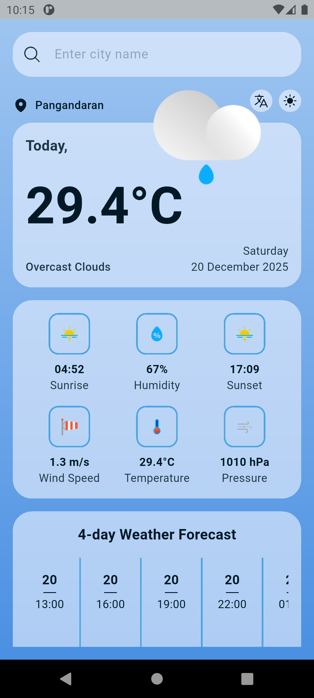
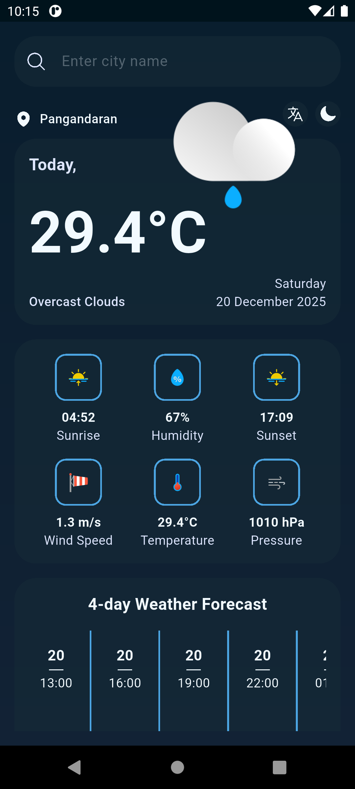
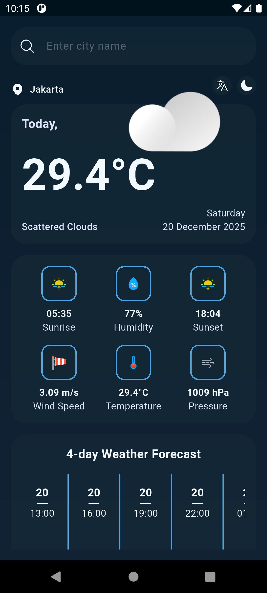
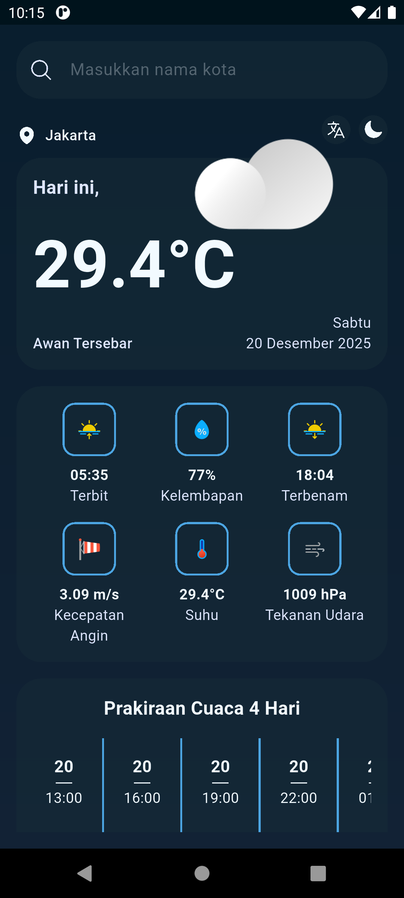

# Weather App (MiWeather) - Simple Weather App

A weather application that displays current weather and a 4-day forecast weather, developed using Clean Architecture, MVVM pattern, and GetX state management.

## 📸 Screenshots & 🔗 Download Link

<div style="display: flex; flex-wrap: wrap; gap: 16px;">
  
  
  
  
</div>

- Download link: https://drive.google.com/file/d/1DOmKKwT7gZAC2O7G3Zg0WghNyule1qYi/view?usp=sharing

## ✨ Features

- Weather detection at current location
- Weather search by city name
- 4-day weather forecast
- Light and dark themes
- Local data storage using SharedPreferences
- Clean and user-friendly UI
- State management using GetX

## 🏗️ Architecture

Using **Clean Architecture** with 3 layers:

- **Domain Layer**: Entities, Repositories, UseCases
- **Data Layer**: Models, DataSources (Remote), Repository Implementations
- **Presentation Layer**: Controllers (MVVM), Screens

## 📦 Tech Stack

- **State Management**: GetX
- **Architecture**: Clean Architecture + MVVM
- **Local Storage**: shared_preferences
- **Error Handling**: dartz (Either pattern)
- **HTTP Client**: http
- **Location**: geolocator

## 🚀 Getting Started

### 1. Install Dependencies

```bash
flutter pub get
```

### 2. Get API Key

Sign up for free at [OpenWeatherMap](https://openweathermap.org/api) to get an API key.

### 3. Setup API Key

Add API_KEY to the environment or open `lib/core/config/env.dart` file:

```dart
static const String apiKey = String.fromEnvironment(
  'API_KEY',
  defaultValue: '', // Replace with your API key
);
```

## 🎨 Theme & 📔 Language

The app supports light and dark themes and English and Indonesian.

## 🔧 Dependencies

```yaml
dependencies:  
  dartz: ^0.10.1                # Functional programming
  equatable: ^2.0.7             # Value comparison
  geocoding: ^4.0.0             # Geocoding
  geolocator: ^14.0.2           # Location
  get: ^4.7.3                   # State management
  heroicons: ^0.11.0            # Icons
  http: ^1.6.0                  # API calls
  intl: ^0.20.2                 # Formatter
  shared_preferences: ^2.5.3    # Local storage
```
